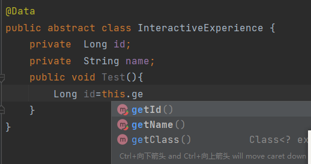

# TJU_DesignPattern_Ayyy

Tongji University 2022, Software School, Design Pattern Course Dessign,Team Ayyy

# 版本

* java8
* Junit 5
* maven 3.8.1( 3.6以上才支持Junit5)

# 编写代码时的注意事项

## 包命名

包命名统一小写，如`package org.ayyy.facilities.interactiveexperience.abstractfactory`

注意！最后一层package需要命名为某设计模式

## 类命名

遵循驼峰命名法，如`public class InteractiveExperienceFactory`

## 测试类的编写

1.test文件夹中，package org.ayyy下新建包，包名为某设计模式，小写

2.新建包中，新建测试类，驼峰命名，**名字必须以Test结尾**，否则Main无法识别

3.测试类中应当包含 Assert 语句

## 注释

* 每个类必须有注释，建议使用自动注释模板，IDEA可在 `File-->Settings-->Editor-->File and Code Templates`配置
* 必须有文字说明，解释该package运用了什么设计模式
* 每个函数必须有注释

## @Data注解

引入lombok依赖，可使用@Data注解减少工作量

案例如下

在类定义上方添加@Data注解，可为每个属性自动生成对应的getter与setter，减少无意义代码。

