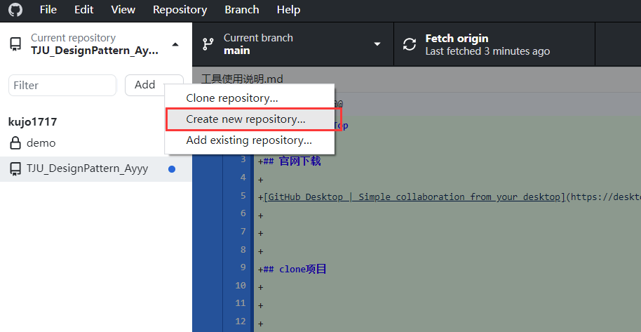

# Github DeskTop

## 官网下载

[GitHub Desktop | Simple collaboration from your desktop](https://desktop.github.com/)

## clone项目

如图，clone云端仓库，在本地新建local仓库

## branch

顶部curernt branch切换分支，Branch->Compare to Branch比较分支

8个人各自创建自己的branch？还是一个模块一个分支。

# VPN：ikuuu clash

## 官网

https://ikuuu.ltd/

## 使用方法

注册登录后，按照官网提供的下载和教程走即可

## 免费节点

clash可免费使用，只有日本节点，可能不稳定

## 付费节点

下面是一个付费会员的windows节点配置

https://api.sub-100.one/link/VkJtKoxvRSx31Mlc?clash=3&extend=1

按照教程走，导入配置时自己手动导入这个配置，即可登录该付费会员。

# Eclipse

没用过，IDE应该不影响项目

# IDEA

## 2022.1.2前的破解

https://www.cnblogs.com/wyj-java/p/16389450.html

## 学生认证

几种学生认证的方法

* tongji.edu邮箱直接认证....?试过不太行

* f楼打印学生证明，IDEA官网发送证明图片，一段时间后即可获得学生认证
* Github的学生包可以直接解锁IDEA大礼包，前提是你要有Github 的学生开发者认证

